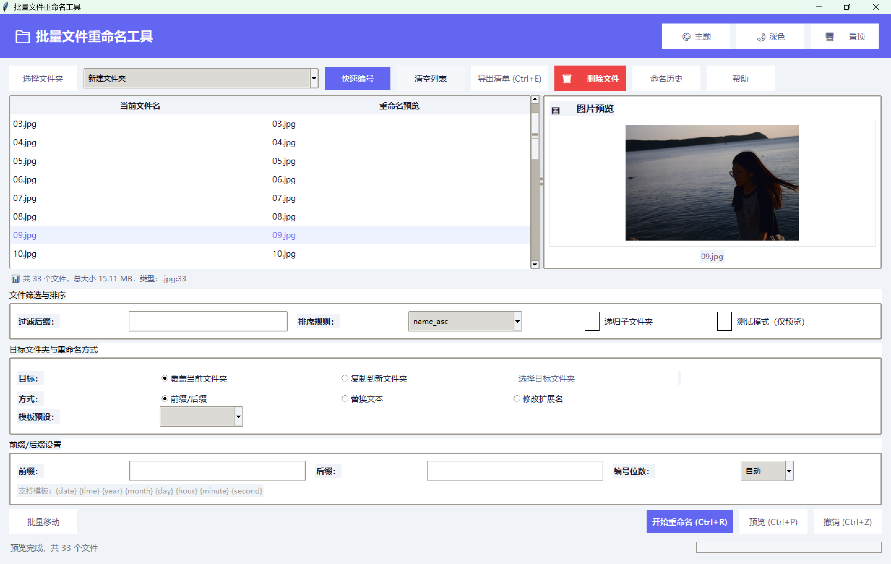

# 批量文件重命名工具

一个功能强大、界面美观的批量文件重命名工具，支持多种重命名模式、智能编号、图片预览等功能。

## ✨ 功能特性

### 核心功能
- **前缀/后缀重命名**：在文件名前后添加自定义内容，中间自动编号
- **文本替换**：替换文件名中的指定文本，支持正则表达式
- **修改扩展名**：批量修改文件扩展名
- **智能编号位数**：自动根据文件数量计算补零位数（支持手动指定）

### 文件管理
- **拖拽导入**：支持直接拖拽文件夹到软件窗口
- **文件过滤**：按后缀筛选文件（如 .jpg, .png）
- **多种排序**：按文件名、修改时间、创建时间、文件大小、扩展名排序
- **递归子文件夹**：扫描所有子文件夹中的文件
- **批量移动**：将选中文件移动到指定文件夹
- **删除文件**：支持批量删除文件

### 高级功能
- **正则表达式**：支持复杂的文本匹配和替换操作
- **日期模板**：支持 `{date}`, `{time}`, `{year}`, `{month}`, `{day}` 等模板
- **模板预设**：提供6种常用命名模板，一键应用
- **一键撤销**：支持最多5次撤销操作
- **测试模式**：仅预览不执行实际重命名

### 视觉体验
- **现代化界面**：采用现代扁平化卡片风格设计
- **深色/浅色主题**：支持主题切换，自动保存设置
- **自定义主题**：提供9种预设主色调，可自定义配色
- **图片预览**：点击图片文件在右侧预览，双击放大查看原图
- **可拉伸分隔条**：调整文件列表和预览区域的宽度

### 其他功能
- **最近文件夹**：记录最近访问的5个文件夹，快速切换
- **命名历史**：保存最近10次重命名规则，一键复用
- **导出清单**：将重命名前后的文件名导出为 CSV 文件
- **统计报告**：重命名完成后显示详细统计信息
- **窗口置顶**：始终显示在其他窗口上方
- **快捷键支持**：Ctrl+A 全选、Ctrl+Z 撤销、Ctrl+R 重命名、Ctrl+P 预览、Ctrl+E 导出

## 🖼️ 界面预览



界面特点：
- **左侧文件列表**：显示当前文件名和重命名预览，支持多选和全选
- **右侧图片预览**：实时预览选中的图片文件，支持双击放大查看原图
- **顶部工具栏**：快速访问常用功能，包括选择文件夹、快速编号、导出清单等
- **底部设置区域**：配置重命名规则、排序方式、目标文件夹等参数
- **状态栏**：显示文件统计信息、操作状态和进度条

## 🚀 快速开始

### 环境要求
- Python 3.8+
- Windows 10/11

### 安装依赖

```bash
pip install pillow tkinterdnd2
```

### 运行程序

```bash
python main.py
```

### 打包成可执行文件

```bash
pip install pyinstaller
pyinstaller --onefile --windowed --hidden-import=tkinterdnd2 --hidden-import=PIL._tkinter_finder main.py
```

生成的可执行文件位于 `dist/main.exe`。

## 📖 使用指南

### 基本操作流程

1. **选择文件夹**：点击"选择文件夹"按钮或拖拽文件夹到窗口
2. **筛选文件**（可选）：在"过滤后缀"输入框中输入后缀进行筛选
3. **排序文件**（可选）：选择排序规则对文件进行排序
4. **选择重命名模式**：
   - **前缀/后缀**：输入前缀和后缀，设置编号位数
   - **替换文本**：输入查找和替换内容，可选正则表达式
   - **修改扩展名**：输入目标扩展名
5. **预览效果**：点击"预览"按钮查看重命名效果
6. **执行重命名**：点击"开始重命名"执行操作

### 日期模板

| 模板 | 示例 |
|------|------|
| `{date}` | 20260716 |
| `{time}` | 153045 |
| `{year}` | 2026 |
| `{month}` | 07 |
| `{day}` | 16 |
| `{hour}` | 15 |
| `{minute}` | 30 |
| `{second}` | 45 |

### 模板预设

| 预设名称 | 效果示例 |
|----------|----------|
| 日期_序号 | 20260716_001.jpg |
| IMG_日期_序号 | IMG_20260716_001.jpg |
| 视频_{time} | 视频_153045.mp4 |
| 文档_{year}{month} | 文档_202607.pdf |
| 扫描件_序号 | 扫描件_001.jpg |
| {date}_{time}_序号 | 20260716_153045_001.jpg |

### 正则表达式示例

```
示例1：移除前缀
查找：^DSC_
替换：（留空）
结果：DSC_0001.jpg → 0001.jpg

示例2：提取数字
查找：^.*?(\d+)\.
替换：image_\1.
结果：photo_001.jpg → image_001.jpg

示例3：日期格式转换
查找：(\d{4})-(\d{2})-(\d{2})
替换：\1\2\3
结果：IMG_2023-12-25.jpg → IMG_20231225.jpg
```

## ⌨️ 快捷键

| 快捷键 | 功能 |
|--------|------|
| `Ctrl+A` | 全选文件 |
| `Ctrl+Z` | 一键撤销 |
| `Ctrl+R` | 开始重命名 |
| `Ctrl+P` | 生成预览 |
| `Ctrl+E` | 导出清单 |

## 📁 项目结构

```
Batch Naming/
├── main.py          # 主程序文件
├── readme.txt       # 项目说明文档
├── dist/            # 打包后的可执行文件（生成）
└── build/           # 打包中间文件（生成）
```

## 🤝 贡献

欢迎提交 Issue 和 Pull Request！

## 📄 许可证

MIT License

## 🙏 致谢

- [Tkinter](https://docs.python.org/3/library/tkinter.html) - Python 标准 GUI 库
- [Pillow](https://pillow.readthedocs.io/) - 图像处理库
- [tkinterdnd2](https://github.com/pmgagne/tkinterdnd2) - 拖拽功能扩展

## 📞 联系方式

如有问题或建议，请通过以下方式联系：
- GitHub Issues
- 邮件：13753054107@163.com

---

**享受批量重命名的便捷！** 🎉
